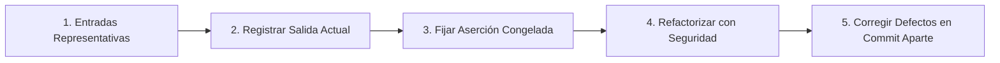
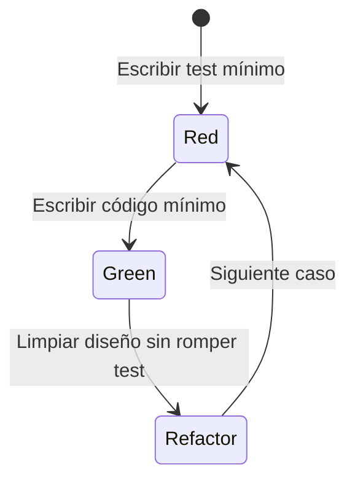

# 🧪 Estrategia de Testing en JavaScript / TypeScript

> **Guía Práctica de Aseguramiento de Calidad**  
> Directrices obligatorias para el diseño, escritura y mantenimiento de pruebas automatizadas. Léela antes de escribir o modificar cualquier test en el repositorio.

---

## 📑 Tabla de Contenidos

1. [La Pirámide de Testing vs. El Cono de Helado](#1-la-pirámide-de-testing-vs-el-cono-de-helado)
2. [Anatomía de un Test Unitario Confiable (AAA & FIRST)](#2-anatomía-de-un-test-unitario-confiable-aaa--first)
3. [Nomenclatura Semántica y Especificación BDD](#3-nomenclatura-semántica-y-especificación-bdd)
4. [Estrategia de Test Doubles: Mocks vs. Stubs vs. Fakes](#4-estrategia-de-test-doubles-mocks-vs-stubs-vs-fakes)
5. [Tests de Caracterización (Refactoring sin Cobertura)](#5-tests-de-caracterización-refactoring-sin-cobertura)
6. [TDD: Ciclo Red-Green-Refactor](#6-tdd-ciclo-red-green-refactor)
7. [Métricas de Cobertura y Pragmatismo](#7-métricas-de-cobertura-y-pragmatismo)
8. [Checklist de Calidad para Pull Requests](#8-checklist-de-calidad-para-pull-requests)

---

## 1. La Pirámide de Testing vs. El Cono de Helado

Diseña la distribución de la suite priorizando velocidad de ejecución y aislamiento de fallos:

| Nivel de Prueba | Proporción | Velocidad | Coste de Mantenimiento | Alcance & Dependencias |
| :--- | :--- | :--- | :--- | :--- |
| **Unitarios** | 70% (Base) | Milisegundos | Muy bajo | Funciones puras, entidades de dominio, servicios aislados (sin I/O). |
| **Integración** | 20% (Centro) | Segundos | Moderado | Módulos colaborando entre sí, repositorios con BD en memoria o adaptadores de red mockeados a nivel transporte. |
| **End-to-End (E2E)** | 10% (Cúspide) | Minutos | Alto | Flujos críticos del usuario a través de la UI completa y servicios reales/emulados. |

> [!WARNING]
> **Antipatrón del Cono de Helado (Ice Cream Cone):**  
> Ocurre cuando se invierte la pirámide (pocos tests unitarios y una masa gigante de tests E2E/UI). Genera suites frágiles, lentas e inestables (*flaky tests*). Un test E2E en rojo indica que algo falló, pero no proporciona la causa raíz exacta. Si detectas esta tendencia en un módulo, señálalo de inmediato.

---

## 2. Anatomía de un Test Unitario Confiable (AAA & FIRST)

### Estructura AAA (Arrange, Act, Assert)
Todo test unitario debe seguir la estructura de tres bloques claramente separados por saltos de línea:

```ts
import { describe, it, expect } from "vitest";
import { placeOrder } from "./order-placement";
import { createAccountFixture, createOrderFixture } from "./__fixtures__/order.fixtures";

describe("placeOrder", () => {
  it("rechaza la orden cuando el saldo en cuenta es insuficiente", () => {
    // Arrange (Preparación de datos y entorno)
    const account = createAccountFixture({ balance: 50 });
    const order = createOrderFixture({ totalAmount: 100 });

    // Act (Ejecución de la acción a verificar)
    const result = placeOrder(account, order);

    // Assert (Comprobación de invariantes)
    expect(result).toEqual({
      status: "rejected",
      reason: "INSUFFICIENT_FUNDS",
    });
  });
});
```

### Propiedades FIRST
Un test de alta calidad cumple rigurosamente con los 5 atributos FIRST:

| Principio | Significado | Criterio de Aceptación |
| :--- | :--- | :--- |
| **Fast** | Rápido | La suite unitaria debe ejecutarse en milisegundos. Si un test se demora, está tocando I/O (red, disco o timers reales). |
| **Independent** | Aislado | Ningún test debe depender del resultado o estado mutable dejado por otro test. Deben poder ejecutarse en orden aleatorio o paralelo. |
| **Repeatable** | Determinista | Mismo resultado en cualquier máquina, entorno o momento. Fija relojes (`vi.useFakeTimers()`) y semillas pseudo-aleatorias. |
| **Self-validating** | Auto-validable | El resultado es estrictamente binario: pasa o falla. No requiere inspección manual de logs en consola. |
| **Timely** | Oportuno | Escrito junto con el código de producción o antes (TDD), no meses después como tarea postergada. |

> [!IMPORTANT]
> **Una sola razón para fallar:** Un test debe validar un único comportamiento conceptual. Tener múltiples aserciones `expect` es válido siempre que todas pertenezcan a la misma invariante o contrato resultante.

---

## 3. Nomenclatura Semántica y Especificación BDD

El nombre del test debe describir el **comportamiento observable del sistema**, no el nombre del método ni detalles internos de la implementación.

```ts
// ❌ Antipatrón: Nombres centrados en la implementación o sin contexto
it("testOrder", () => {});
it("should work correctly", () => {});
it("executeMethodReturnsTrue", () => {});

// ✅ Estándar BDD: Especificación viva del negocio
describe("PlaceOrderUseCase", () => {
  it("rechaza la orden cuando el cliente supera su límite de crédito", () => {});
  it("descuenta el stock del inventario cuando la compra es confirmada", () => {});
  it("emite un evento OrderPlacedEvent tras persistir los datos", () => {});
});
```

> [!TIP]
> **Test de la lectura en voz alta:** Lee el bloque `describe` junto con el `it`. Si juntos forman una oración gramaticalmente natural que cualquier analista de negocio o desarrollador entienda sin ver el código, el test está correctamente nombrado.

---

## 4. Estrategia de Test Doubles: Mocks vs. Stubs vs. Fakes

| Tipo de Doble | Propósito | Cuándo Usarlo |
| :--- | :--- | :--- |
| **Dummy** | Rellenar parámetros requeridos por tipado que no se usarán. | Objetos de configuración con valores por defecto. |
| **Stub** | Proveer respuestas predeterminadas a llamadas en el test. | Simular respuestas fijas de un servicio o consulta. |
| **Mock / Spy** | Verificar interacciones (número de llamadas, argumentos). | Fronteras externas (ej. verificar que se llamó al SDK de email). |
| **Fake** | Implementación funcional simplificada en memoria. | Repositorios, colas de mensajes y caches para tests rápidos. |

### Regla de Oro: Mockea las Fronteras, No la Lógica Interna
- **SÍ mockear:** I/O externa (HTTP, reloj del sistema, sistema de archivos, variables de entorno volátiles).
- **NO mockear:** Entidades de dominio, algoritmos de cálculo, funciones de utilidad pura ni las estructuras internas del componente bajo prueba.

#### ✅ Ejemplo: Fake en Memoria vs. Mock Frágil
```ts
// ✅ Fake en memoria: robusto ante refactorizaciones, no se rompe por cambios de implementación interna
export class InMemoryOrderRepository implements OrderRepository {
  private readonly orders = new Map<string, Order>();

  async save(order: Order): Promise<void> {
    this.orders.set(order.id, order);
  }

  async findById(id: string): Promise<Order | null> {
    return this.orders.get(id) ?? null;
  }

  // Método auxiliar solo para comprobación en tests
  getAll(): Order[] {
    return Array.from(this.orders.values());
  }
}
```

> [!CAUTION]
> Un test saturado de mocks espías (`expect(service.internalMethod).toHaveBeenCalledTimes(1)`) no verifica que el sistema funcione; verifica que el código fue escrito con una sintaxis específica. Al refactorizar, estos tests fallan pese a que el comportamiento es idéntico, transformándose en una carga de mantenimiento.

---

## 5. Tests de Caracterización (Refactoring sin Cobertura)

Al enfrentarte a código legado sin pruebas, **nunca refactorices a ciegas**. Escribe primero tests de caracterización (Golden Master):



### Protocolo Paso a Paso
1. **Identificar entradas:** Determina combinaciones típicas de entradas (caso feliz, valores límite, datos inválidos).
2. **Ejecutar y observar:** Corre el código original y anota exactamente lo que devuelve.
3. **Fijar aserción:** Escribe el test afirmando la salida actual, **incluso si consideras que es un bug**. El objetivo inicial es garantizar que el comportamiento no cambie involuntariamente.
4. **Refactorizar:** Con la suite en verde, aplica mejoras de diseño (SOLID, tipado). Si algún test falla, alteraste el comportamiento preexistente.
5. **Corrección de bugs:** Una vez cerrado el refactor, abre un nuevo commit enfocado exclusivamente en corregir el defecto y ajustar la aserción correspondiente.

---

## 6. TDD: Ciclo Red-Green-Refactor



1. **🔴 Red:** Escribe el test más pequeño posible que especifique el siguiente incremento de comportamiento. Ejecútalo y comprueba que falla por el motivo esperado.
2. **🟢 Green:** Escribe la solución más simple y directa para poner el test en verde (incluso si la implementación inicial es rústica).
3. **🔵 Refactor:** Limpia duplicaciones, refina nombres y aplica patrones con la suite protegiendo contra regresiones.

> [!TIP]
> **¿Cuándo aplicar TDD estricto?**  
> Aplícalo cuando el requerimiento de negocio esté nítido pero el diseño de la solución sea incierto o complejo. En fases de prototipado exploratorio contra APIs desconocidas (*spikes*), explora primero y consolida los tests al estabilizar las interfaces.

---

## 7. Métricas de Cobertura y Pragmatismo

La cobertura de código (`coverage`) mide las líneas o ramas ejecutadas durante la suite, **no si las aserciones son significativas**.

- **Indicador de riesgo:** Úsala para detectar zonas oscuras de la aplicación (ej. un módulo crítico de facturación con 0% de cobertura es una alerta roja).
- **El mito del 100%:** Forzar el 100% suele incentivar tests de bajo valor (verificar getters/setters triviales o tipos de TypeScript).
- **Regla del Boy Scout en PRs:** La cobertura general del repositorio **nunca debe disminuir** tras la incorporación de un cambio.

> [!NOTE]
> Una suite con 75% de cobertura compuesta por tests con aserciones semánticas y contratos de negocio ofrece infinitamente más seguridad que una con 98% llena de aserciones vacías o mocks que no prueban nada real.

---

## 8. Checklist de Calidad para Pull Requests

Antes de aprobar un cambio o enviar un PR, valida:

- [ ] ¿Los tests se ejecutan de forma completamente autónoma y rápida?
- [ ] ¿Cada test sigue la estructura visual y lógica **AAA**?
- [ ] ¿Los nombres de los tests describen comportamientos de negocio y no detalles de código?
- [ ] ¿Se evitaron dependencias de I/O real (red, BD externa, timers no congelados) en tests unitarios?
- [ ] ¿Los dobles de prueba se reservaron exclusivamente para las fronteras del sistema?
- [ ] ¿No se deshabilitaron pruebas (`.skip`, `.only`, `xit`) para forzar un pipeline verde?
- [ ] ¿La cobertura del paquete o módulo se mantiene o incrementa con este cambio?

